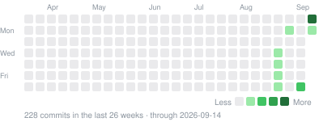

<div align="center">


# QuotaBar

**Every AI coding limit, at a glance — in the menu bar, the notch, at the screen's edge or on the desktop.**

[](https://github.com/gentpan/QuotaBar/releases/latest)
[](https://github.com/gentpan/QuotaBar/releases)
[](https://github.com/gentpan/QuotaBar/stargazers)
[](https://github.com/gentpan/QuotaBar/commits/main)
[](https://github.com/gentpan/QuotaBar/graphs/commit-activity)
[](https://github.com/gentpan/QuotaBar/actions/workflows/ci.yml)
[](https://github.com/gentpan/QuotaBar/releases/latest)
[](LICENSE)

QuotaBar is a macOS menu-bar app that shows how much of each AI coding service's quota
you have used, when each window resets, and roughly what it has cost — for twenty-three
providers, read and worked out on your own Mac. No account, no telemetry.

[Download](https://github.com/gentpan/QuotaBar/releases/latest) ·
[Website](https://quota.bar) ·
[Changelog](CHANGELOG.en.md) ·
[Architecture](ARCHITECTURE.md)

**English** · [简体中文](README.zh-CN.md)

</div>

---

## Install

```bash
brew tap gentpan/tap
brew trust gentpan/tap      # Homebrew 6 gates third-party taps
brew install --cask quotabar
```

Or download the `.dmg` from [Releases](https://github.com/gentpan/QuotaBar/releases/latest)
and drag `QuotaBar.app` into `/Applications`. Builds are signed with a Developer ID
certificate and notarized by Apple, so Gatekeeper opens them without a detour.

Requires macOS 14 (Sonoma) or later. Apple Silicon and Intel. The interface is in
English and Simplified Chinese and follows the system language unless you pick one.

## Recent updates

<!-- changelog:start -->
<!-- Generated from CHANGELOG.en.md by Scripts/sync_changelog.py. Do not edit by hand. -->

Latest release **0.5.3** (2026-09-13) · **16** changes in development · [full changelog](CHANGELOG.en.md)

<details open>
<summary><b>2026-09-13</b> · Unreleased · 8 added · 5 style · 3 fixed</summary>

**Added**

- The right-click menu on a provider card in the panel gains three groups of quick settings. "Limits on the Card" ticks which limits show and which fold under the disclosure arrow, remembered per provider, with Restore Default, and the last one cannot be unticked. "Ring Follows" picks the window the dock ring, notch island and menu bar follow, the same choice as double-clicking a window. "Show In" ticks whether the provider appears in the panel, the dock, the notch island and desktop cards, plus "Menu Bar Shows Only" this provider and "Add a Desktop Card" for it. "Hide from Panel" and "Ring follows the fullest window" fold into these groups.
- Updates come as an update card: when a new version is found, a card shows its number, the version you have, the release date and what changed (in the interface's language, grouped into added, style and fixed, with Show all and a link to the full changelog). Install and Relaunch downloads it, checks the developer's signature and Apple's notarization, then replaces the app and relaunches; the app no longer relaunches without asking. The Updates setting becomes "Download in background" (downloaded and verified as soon as it is found, so installing is instant) or "Download when I install". If replacing the app fails, for example without write access to Applications, the card says why and offers Try Again and Download Installer. The menu bar's right-click menu, the panel's banner and the Updates page all open the card, which opens by itself once per version per launch.
- Spend budgets: Settings → Alerts has a new Spend card with a daily and a monthly budget (in the currency chosen when set; empty means none). A notification comes once at 80% and once when a budget is passed, per day and per calendar month.
- Weekly digest: after 9 on Monday morning, a notification with last week's spend, token count and the busiest CLI's share; nothing is sent for a week without usage. It can be turned off under Settings → Alerts → Spend.
- A reset calendar: Settings → Usage opens with "Resets in the next 7 days", listing by day when each enabled provider's windows start again (today, tomorrow, then dates and times) with how much is left or used, amber or red when close to the limit.
- The dock rings' right-click menu gains the same three groups as a panel card's: Limits on the Card, Ring Follows and Show In.
- Quota Run: a new Quota Run page in Settings. Without an account, every reading goes into a local run ledger (60 days) showing windows in progress and personal bests — fastest to 100%, time to 50% and 90%, highest peak — and a best can be copied or saved as a share image. To compete, tick the list of what is uploaded and choose Sign In with quota.run: the app opens the browser and shows a code; sign in on quota.run with Google, GitHub or an email code (picking a username the first time), check the code and approve this Mac. The app never handles a password or a third-party token. This Mac then signs with a key in the Secure Enclave and, as the ranked device, uploads quota readings and per-minute token counts to quota.run; the server computes results and ranks, shown at quota.run and on a public profile at quota.run/@username. Signed in, the page shows @username, how the account signs in and each Mac's QuotaBar version; edit a profile and up to 12 projects, or open the account page with Manage Account on quota.run. Another Mac joins by signing in with the same account, the ranked device changes once every 7 days, Disconnect This Mac keeps the account and local records, and Delete Account removes everything on quota.run, each after a confirmation. Ranked results and each run's usage curve are public on quota.run, while the sign-in email is used only to sign in and never shown on a profile or board; the consent text says so. Credentials, tokens, prompts, code, file paths and plain emails are never uploaded, and nothing at all is uploaded without joining. The About page's list of connections includes Quota Run.
- Quota Run provider accounts: only readings that say which provider account they come from are uploaded and ranked, and the app uploads only a one-way digest of the account email, which never leaves the Mac. Each Codex, Claude or other provider account belongs to one Quota Run account: the first to upload it, unless another account signs in with that same email and claims it, which shows Account verified on its runs. Settings → Quota Run gains a Provider Accounts card listing the account each provider is signed in with on this Mac (email masked) and its status — Not uploaded yet, Bound, Account verified, or Owned by another Quota Run account with how to claim it — with Unbind (after a confirmation, deletes that account's readings and runs on quota.run and stops uploading it from this Mac) and Bind Again. Personal bests mark a run without a bound account as "Not bound to an account — won't rank".

**Style**

- An expanded row in Settings → Providers no longer gives "Test connection" and "Console" a line of their own: "Console" follows the provider's name and "Test connection" sits on the right ahead of the service status, level with the name; the test's result still appears below. Providers that need Save, browser sign-in or keychain authorisation keep those buttons on a line below.
- Each Settings section's title and its explanation now share one line, on a common baseline, instead of stacking; in a narrow window the explanation is cut short first, with the full text on hover.
- "Test connection" in a provider row's header is a small chip with an icon, about as tall as the status pills, instead of a 30 pt button that made an open row taller than a closed one; in the open row, the service status text now lines up with its label, where it sat about 7 pt higher.
- Provider cards show the limits that fit the plan: Codex shows the plan's own limits — the 5-hour and the week on plans that have a 5-hour limit, the week alone on Pro, which has none — with GPT-5.3-Codex-Spark's limits under the disclosure arrow; Claude shows the 5-hour, the week and Fable. The window the ring follows is always shown. Other providers are unchanged.
- Dragging a provider card near the top or bottom of the panel's list scrolls the list, faster nearer the edge, with the card staying under the pointer, so a card can reach either end of a long list.

**Fixed**

- Switching the interface language lost the choices of what the ring follows and which limits a card shows: they are kept by window name, and window names change with the language ("周窗口" and "Weekly window"). The reread in the new language now carries each choice over to the same window's new name.
- The local API (127.0.0.1:6736) answers only requests addressed to 127.0.0.1 or localhost and refuses cross-site origins, so a web page cannot read the figures through DNS rebinding; anything else gets 403.
- After switching Codex, Claude or another CLI to a different account, the next reading could pass for a reset — the other account's usage is lower and its reset time different — with a reset banner and notification, and the trend line joined the two accounts. A reading from a different account than last time is no longer a reset, and that provider's trend starts afresh.

</details>

<details>
<summary><b>2026-09-13</b> · 0.5.3 · 1 added · 1 fixed</summary>

**Added**

- The menu bar icon's right-click menu is redone. A new "Show in Menu Bar" submenu offers "Automatic (fullest limit)" or any enabled provider, each with its mark and the figure the icon would show (left or used), the current choice ticked; the choice is the menu bar's own, and the dock, notch island and desktop cards keep theirs. The menu also gains "Check for Updates…" (which reads "Update to x.y.z…" when one is available and "Restart to Update to x.y.z" once downloaded), "Feedback…" and "About QuotaBar", alongside Refresh Now (⌘R), Settings (⌘,) and Quit (⌘Q).

**Fixed**

- With automatic update checks turned off, "Check now" on the Updates page and "Check for Updates…" in the panel's options menu did nothing; a check you ask for now runs regardless of that switch.

</details>

<details>
<summary><b>2026-09-13</b> · 0.5.2 · 2 added · 1 style</summary>

**Added**

- The edge dock scrolls when there are more providers than the screen can hold: the strip grows until it is 24 pt from the top and bottom of the screen, and the rest of the rings scroll inside it with the wheel or trackpad. The system scroller is replaced by a 2 pt line on the inboard side, faint at rest, brighter while scrolling, fading back once it stops; where there are more rings above or below, the ends fade into the black. Scrolling puts away the hover card, cards line up with their ring allowing for the scroll, and when a limit resets its ring is scrolled into view first.
- Provider cards in the panel can be dragged into a new order: the card lifts slightly and follows the pointer, trades places with a neighbour once it is halfway over it while the others slide aside, and settles into its slot on release. The new order is used by the dock, the notch island and desktop cards too. Clicks inside a card (used or left, reset times and so on) still work, since a drag starts only after a few points of movement, and releasing outside the panel still settles the card and saves the order.

**Style**

- The About page's GitHub link shows the repository's new name, gentpan/QuotaBar, and the feedback and update-check addresses use it too.

</details>

<!-- changelog:end -->

## Activity

<p align="center">
  
</p>

<p align="center">
  <a href="https://star-history.com/#gentpan/QuotaBar&Date">
    <picture>
      <source media="(prefers-color-scheme: dark)" srcset="https://api.star-history.com/svg?repos=gentpan/QuotaBar&type=Date&theme=dark">
      
    </picture>
  </a>
</p>

## Providers

| Provider | Source | Credential |
|---|---|---|
| Codex | `~/.codex/auth.json` OAuth → `chatgpt.com/backend-api/wham/usage` | automatic |
| Claude | Claude Code keychain item → `api.anthropic.com/api/oauth/usage` | automatic |
| Gemini | `~/.gemini/oauth_creds.json` → `cloudcode-pa.googleapis.com` | automatic |
| Grok | `~/.grok/auth.json` → `cli-chat-proxy.grok.com/v1/billing` | automatic / manual |
| Antigravity | `~/.gemini/jetski-standalone-oauth-token` → `cloudcode-pa.googleapis.com` | automatic |
| Cursor | Cursor's own `state.vscdb` session → `cursor.com/api/usage-summary` | automatic / manual |
| OpenCode Go | `~/.local/share/opencode/auth.json` → `opencode.ai/zen/go/v1/usage` | automatic / manual |
| Kimi Code | `kimi.com` billing gateway | manual `kimi-auth` JWT |
| z.ai | `api.z.ai/api/monitor/usage/quota/limit` | manual API key |
| MiniMax | `api.minimax.io` coding-plan remains | manual token / cookie |
| Manus | `api.manus.im` credits | manual session token |
| DeepSeek | `api.deepseek.com/user/balance` | manual API key |
| Qwen Cloud | `home.qwencloud.com` console → token plan usage | manual Cookie header |
| GitHub Copilot | GitHub CLI sign-in (`gh auth token`) → `api.github.com/copilot_internal/user` | automatic / manual |
| 阿里云百炼 Coding Plan *(experimental)* | Bailian console gateway → coding plan quota | Cookie header / in-app sign-in |
| 火山方舟 *(experimental)* | `arkcli usage plan --format json` | automatic (arkcli login) |
| 智谱 GLM *(experimental)* | `open.bigmodel.cn/api/monitor/usage/quota/limit` | manual API key |
| Kimi 开放平台 *(experimental)* | `api.moonshot.cn/v1/users/me/balance` | manual API key |
| OpenRouter *(experimental)* | `openrouter.ai/api/v1/credits` + `/key` | manual API key |
| 小米 MiMo *(experimental)* | `platform.xiaomimimo.com/api/v1` balance + token plan | Cookie header / in-app sign-in |
| Qoder *(experimental)* | `qoder.com/api/v2/me/usages/big_model_credits` | manual Cookie header |
| Windsurf *(experimental)* | Windsurf's own `state.vscdb` cached plan | automatic |
| Kiro *(experimental)* | `kiro-cli` session → AWS `GetUsageLimits` | automatic |

*Experimental* providers are built from the services' own consoles and CLIs but have not
yet been checked against a live account; they are labelled as such in Settings.

**No dialog, normally.** Claude is the only provider whose session lives in *another
app's* keychain item. QuotaBar reads it the way Claude Code itself does — through
`/usr/bin/security`, which every item that tool writes trusts — so macOS has nothing to
ask, whatever the build is signed with. Only if that read is refused does the
**Allow keychain access** button appear, and the dialog is never raised from a background
refresh — only from that button.

## Where the numbers show

**Menu bar and panel**
- Eleven glyph styles, four of them *stepped* so the reading can be counted rather than
  estimated; or a text reading, the logo alone, or nothing.
- The glyph splits a **short** horizon (5-hour, rolling) from a **long** one (weekly,
  billing cycles), because collapsing them hides which limit is actually near.
- Click it for the panel: a spend card on top — spend, tokens or cost per million
  tokens, for today, yesterday or 30 days, split by CLI — then one card per provider
  with its two most important windows; the rest, the trend, 30-day spend and the status
  page fold out beneath.
- Click any percentage to flip between used and left, any reset time between a countdown
  and the clock. Right-click a card to copy it as an image.
- `Esc` closes, `⌘R` refreshes everything, `⌘,` opens Settings. A global hotkey can open
  it from anywhere.

**Notch island** — on notched Macs the figures sit either side of the notch. Hover to open
three pages (limits, usage, overview) with five chart styles. A soft glow turns amber and
red as a limit nears, and the island peeks out on its own the first time one crosses the
warning line. A low-power mode glows only when something happens.

**Edge dock** — hides until the pointer reaches the screen edge. Double-click a window
(5-hour, weekly, a model's own) to choose what its ring shows.

**Desktop cards** — as many as you like, sitting on the desktop below your windows or
kept above them: big figure, gauge, spend trend, day by day, provider grid, closest to the
limit, and the classic list, each in small, medium or large. Drag to move, double-click
for the panel, right-click to change style, size or provider.

With two screens, choose which one the island, dock and cards appear on.

## Pace, alerts and spend

- **Pace.** A thin tick on every bar marks where even use would be by now. A window on
  course to finish tight says so; one on course to run out shows a flame and when.
- **Alerts.** Warning and critical thresholds, plus *almost out*, *cutting it close* and
  *will run out* — each fires once per crossing and once per reset period.
- **Resets.** QuotaBar reads a provider again the moment a window resets, and marks it
  in that provider's colour: the dock slides out and sweeps the ring full with a card
  beside it, the island opens a "limit reset" banner, the menu-bar glyph refills with a
  sheen, and the row says it just reset; a notification follows if the window had been
  used past 90%.
- **Spend.** Estimated locally from Claude Code, Codex CLI and OpenCode session logs, in
  dollars or one of ten other currencies at daily reference rates, counting all tokens or
  input and output only. QuotaBar keeps its own day-by-model archive, so the figures do
  not shrink when a CLI prunes old logs.
- **Usage page.** A year heatmap and volume chart in Settings.
- **Share card.** Your last 7 days, 30 days, 3 months, year or all time, by API value or
  tokens; the card turns black past $1,000 and blue past $10,000. 4:5, 1:1 or 9:16, saved
  as a 1080-pixel PNG or copied.
- **Service status.** The providers' own status pages, judged by the coding components —
  Claude Code, the Codex CLI — with 30 days of history in Settings.

## Your data

Automatic providers reuse the session your CLI already created — the app never asks for a
password. Manually entered tokens go to the **macOS login keychain**, never to a file.
Preferences live in `~/.config/quotabar/config.json` (mode `0600`) and contain no
secrets. There is no analytics and no telemetry.

QuotaBar connects only to:

- the usage endpoints of the providers you turn on, with your own session or key;
- their public status pages, such as `status.claude.com`;
- `open.er-api.com`, once a day, for exchange rates;
- GitHub, to check for and download updates and to fetch model prices (LiteLLM's catalog);
- `quota.bar`, only when you send feedback.

With a proxy set (HTTP, HTTPS or SOCKS5), all of it goes through the proxy. Your usage is
never sent to a server of ours. While a screen share or recording is on, QuotaBar can
hide the figures and leave only its mark in the menu bar.

## For other tools

Turn on **Local API** in Settings → General and QuotaBar serves JSON on this Mac only:

```bash
curl http://127.0.0.1:6736/v1/limits   # every window, percent and reset
curl http://127.0.0.1:6736/v1/spend    # dollars and tokens: today, yesterday, 30 days
```

No credentials, no account names. From a terminal, the same limits without the app open:

```bash
/Applications/QuotaBar.app/Contents/MacOS/QuotaBar --json          # cached up to five minutes
/Applications/QuotaBar.app/Contents/MacOS/QuotaBar --json --force  # ask every provider now
```

## First run

1. On a fresh install QuotaBar turns on only the providers whose tools it finds signed in
   on this Mac, and a welcome card in the panel says how many.
2. Automatic providers need the matching CLI signed in (`codex`, `claude`, `gemini`,
   `grok`, `gh`) or the app installed (Cursor, Windsurf).
3. Manual providers: open Settings → **Providers**, paste the token described under the
   row, then **Test connection** — it bypasses every cache and asks the source directly.

The panel refreshes every 5, 15 or 30 minutes, on wake, and when the network comes back;
the footer's button refreshes everything at once. Upgrading from a build that stored
credentials in `config.json`? They are moved into the keychain on first launch and erased
from the file.

## Build & run

Requires macOS 14+ and a **full Xcode toolchain** — CommandLineTools alone lacks the
SwiftUI macro plugin, so the build fails on `@State`.

```bash
export DEVELOPER_DIR=/Applications/Xcode-beta.app/Contents/Developer
swift build && swift test
UNIVERSAL=0 ./Scripts/package_app.sh   # QuotaBar.app in place; drop UNIVERSAL=0 for Intel too
open QuotaBar.app
```

The app is a menu-bar agent, so there is little to screenshot. Render the surfaces
off-screen instead — CI runs the first two as smoke tests. Add `--lang en` or `--lang zh`
to render one language:

```bash
.build/debug/QuotaBar --snapshot ./snapshots             # panel, dock, notch strip
.build/debug/QuotaBar --settings-preview ./settings      # every settings section, both languages
.build/debug/QuotaBar --icon-preview ./icons             # all eleven menu-bar styles
.build/debug/QuotaBar --island-preview ./island          # island pages and chart styles
.build/debug/QuotaBar --widget-concepts ./cards          # every desktop card, every size
```

Glass, vibrancy and springs only exist on screen — `ImageRenderer` draws none of them.
For those, open the real thing:

```bash
.build/debug/QuotaBar --settings-window about
.build/debug/QuotaBar --panel-window
QUOTABAR_DOCK_TRACE=1 QUOTABAR_DOCK_SLIDE=2 ./QuotaBar.app/Contents/MacOS/QuotaBar
```

For a single provider: `QuotaBar --provider claude`; for the status pages:
`QuotaBar --status`.

## Distribution

Developer ID only, not the App Store — the sandbox forbids reading `~/.codex`,
`~/.claude` and another app's keychain item, which is the entire feature set.

`package_app.sh` picks its signing tier automatically:

| What you have | What others get |
|---|---|
| Nothing | Ad-hoc signature — runs on your Mac only. Others see *"QuotaBar is damaged"*. |
| Developer ID certificate | Hardened runtime. Others see *"Apple cannot check it for malicious software"*. |
| Certificate + notarization | Gatekeeper accepts it — the normal *"downloaded from the internet"* prompt. |

Store a notarization credential once (needs an
[app-specific password](https://appleid.apple.com)):

```bash
xcrun notarytool store-credentials QuotaBar \
  --apple-id you@example.com --team-id <YOUR_TEAM_ID>
```

### Cutting a release

```bash
./Scripts/release.sh
```

Notarizes, staples, zips with `ditto` (which preserves the ticket), builds a signed and
notarized `.dmg`, computes both SHA-256s, and writes a ready-to-commit Homebrew cask to
`dist/quotabar.rb`. It **refuses to produce a release if Gatekeeper still rejects the
bundle**, so a half-signed build cannot reach users by accident. The app updates itself
only from a download signed by this app's developer and notarized by Apple.

## Spend estimates

Computed locally from `~/.claude/projects/**/*.jsonl`,
`~/.codex/sessions/**/rollout-*.jsonl` and OpenCode's own database, priced from a live
catalog that matches exact model ids. They are an estimate for orientation, **not a
bill** — they cannot see plan-included usage, discounts, or anything that happened
outside these CLIs.

Two things are easy to get wrong here and are pinned by tests: Claude Code writes the
same assistant turn into every session file that replays it (deduplicated on
`message.id` + `requestId`), and Codex reports `input_tokens` inclusive of
`cached_input_tokens` (not double-charged).

## Architecture

- `Sources/QuotaCore` — provider protocol, HTTP helpers, config and keychain store,
  credential readers, cost estimator and usage archive, pricing catalog, status pages,
  updater, one file per provider group.
- `Sources/QuotaBar` — the app: an AppKit status item and panels hosting SwiftUI — usage
  store, menu-bar glyph, panel, settings, notch island, edge dock, desktop cards, share
  card, local API.
- `Tests/QuotaCoreTests` — parser fixtures, cost regressions, config migration, updater
  verification. Everything testable lives in QuotaCore.
- `site/index.html` — the website's template, every piece of copy written as
  `[[English||中文]]`; `Scripts/sync_changelog.py` builds it into `web/` (English at the
  root, Chinese under `web/zh/`). `web/` is what gets deployed.

Adding a provider, and every design decision worth knowing before changing one:
[ARCHITECTURE.md](ARCHITECTURE.md). Every change to the app is logged, dated, in
[CHANGELOG.en.md](CHANGELOG.en.md) (English) and [CHANGELOG.md](CHANGELOG.md) (Chinese).

## Acknowledgements

QuotaBar builds on these open-source projects and this typeface. Thank you.

| Project | Author | License | What QuotaBar took |
|---|---|---|---|
| [codex-island](https://github.com/ericjypark/codex-island) | Eric Park | MIT | The notch island's look and motion |
| [OpenUsage](https://github.com/robinebers/openusage) | Robin Ebers | MIT | The menu panel, pace hints and the share card |
| [CodexBar](https://github.com/steipete/CodexBar) | Peter Steinberger | MIT | How providers report their usage; QuotaBar is a clean-room Swift implementation inspired by it |
| [theSVG](https://github.com/GLINCKER/thesvg) | thesvg.org | MIT | The vector masters of the provider logos, kept in `Assets/logos-src-*.svg` |
| [Instrument Sans](https://github.com/Instrument/instrument-sans) | The Instrument Sans Project Authors | SIL OFL 1.1 | The typeface of the QuotaBar wordmark and the website |

QuotaBar is an independent third-party app. It is not affiliated with, endorsed by, or
sponsored by Anthropic, OpenAI, Cursor, Google, xAI, GitHub, X or any other company it
mentions. Their names and logos belong to their respective owners.

## License

MIT — see [LICENSE](LICENSE).
