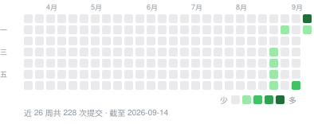

<div align="center">


# QuotaBar

**每个 AI 编码额度，抬眼就看见——在菜单栏、刘海、屏幕边缘或桌面上。**

[](https://github.com/gentpan/quotabar/releases/latest)
[](https://github.com/gentpan/quotabar/releases)
[](https://github.com/gentpan/quotabar/stargazers)
[](https://github.com/gentpan/quotabar/commits/main)
[](https://github.com/gentpan/quotabar/graphs/commit-activity)
[](https://github.com/gentpan/quotabar/actions/workflows/ci.yml)
[](https://github.com/gentpan/quotabar/releases/latest)
[](LICENSE)

QuotaBar 是一款 macOS 菜单栏应用，显示每个 AI 编码服务的额度用了多少、各个窗口何时重置、
大约花了多少钱。支持 23 个服务商，全部在你自己的 Mac 上读取和计算。无需注册账号，没有任何统计上报。

[下载](https://github.com/gentpan/quotabar/releases/latest) ·
[官网](https://quota.bar) ·
[更新日志](CHANGELOG.md) ·
[架构说明](ARCHITECTURE.md)

[English](README.md) · **简体中文**

</div>

---

## 安装

```bash
brew tap gentpan/tap
brew trust gentpan/tap      # Homebrew 6 需要先信任第三方 tap
brew install --cask quotabar
```

也可以从 [Releases](https://github.com/gentpan/quotabar/releases/latest) 下载 `.dmg`，
把 `QuotaBar.app` 拖进「应用程序」。安装包使用 Developer ID 证书签名并经过 Apple 公证，
Gatekeeper 可以直接打开。

需要 macOS 14（Sonoma）或更高版本，支持 Apple 芯片和 Intel。界面提供英文和简体中文，
默认跟随系统语言，也可以在设置里指定。

## 最近更新

<!-- changelog:start -->
<!-- 由 Scripts/sync_changelog.py 从 CHANGELOG.md 生成，请勿手改。 -->

最新版本 **0.5.0**（2026-09-13） · 开发中 **11** 项改动尚未发布 · [完整更新日志](CHANGELOG.md)

<details open>
<summary><b>2026-09-13</b> · 未发布 · 新增 2 · 样式 7 · 修复 2</summary>

**新增**

- 服务商可以按位置隐藏，而不必停用：下拉面板、停靠条、刘海岛、桌面卡片各自决定显示哪些服务商。隐藏的服务商仍会读取数据、发提醒、计入花费，停用才会停止读取。设置 → 展示方式新增「各处显示的服务商」，每个服务商一行，点位置标签即可显示或隐藏；也可以右键下拉面板里的卡片选「在下拉面板中隐藏」，右键停靠条图标选「在停靠条中隐藏」。
- 下拉面板底部在有隐藏的服务商时显示「N 个已在面板隐藏」和它们的图标，点「显示」可逐个恢复或打开设置管理；停靠条右键菜单也列出已隐藏的服务商。

**样式**

- 下拉面板页脚的刷新提示：点「全部刷新」或自动刷新完成后的一分钟内显示「刚刚更新」，之后显示「X 分钟后自动刷新」；鼠标悬停显示上次更新和下次自动刷新的具体时间及刷新间隔。以前刷新完立刻显示「5 分钟后刷新」，看起来像按钮没起作用。
- 节奏提示的文案改为「预计重置时剩 8%」，不再写成含糊的「约 8% 余量」；鼠标悬停时写出算法和用到的数字，例如「这个窗口已过 87%，已用 80%。按这段时间的平均速度，到重置时约用到 92%，剩 8%」。
- 服务状态的「运行正常」改为「服务正常」；悬停状态点或状态标签时写明来源，例如「来自官方状态页 status.claude.com，按 Claude Code、Claude API 判断，3 分钟前检查」，说明它反映的是服务商官方的服务状态，不是本机登录或额度读数。
- 边缘停靠条靠近时只展开出图标，不再立刻弹出左侧卡片：等停靠条完全展开后，把鼠标移到某个图标上才显示该服务商的详情卡片；之后在图标之间移动，卡片会直接跟着切换。锁定显示时悬停图标直接显示卡片。
- 边缘停靠条的展开改为两段：小胶囊先横向拉宽，再纵向拉高，圆环在形状里淡入滑出，不会露在黑色区域外；收起时先缩短高度，再收窄回胶囊。
- 字标 QuotaBar 的字体从 Sora 换成 Instrument Sans 半粗，设置侧边栏、关于页、下拉面板、刘海岛、分享卡片和复制图片的底栏都跟着换；关于页开源致谢里的字体一并改为 Instrument Sans。
- 分享用量卡片窗口不再有单独的灰色标题栏：标题栏改为透明，卡片预览和右侧设置一直铺到窗口顶部，和设置窗口一样是一整块；卡片和右侧标题避开左上角的红绿灯按钮并上下对齐。

**修复**

- 额度窗口刚开始时节奏估算会乱报（例如 5 小时窗口开始 3 分钟用了 3%，就推算成会用完）：现在至少过了窗口时长的 5%、且不少于 15 分钟，才给出余量、会用完和用完时间的判断；已经用完的仍会立即显示。
- 边缘停靠条悬停展开时会先瞬间离开屏幕边缘、露出一条缝隙：窗口不再在展开和收起时改变尺寸，只让黑色形状在窗口里生长，全程贴着屏幕边缘；没画出来的透明区域让鼠标直接穿透。

</details>

<details>
<summary><b>2026-09-13</b> · 0.5.0 · 新增 40 · 样式 10 · 修复 13</summary>

**新增**

- 下拉面板回归：左键点菜单栏图标打开，右键仍是刷新、设置、退出。面板顶部是花费卡片，下面每个服务商一张卡片，底部显示版本、下次刷新倒计时、设置和选项菜单。按 Esc 关闭，⌘R 刷新，⌘, 打开设置。
- 花费卡片：可切换花费、Token、每百万 token 花费三种口径，以及今日、昨日、近 30 天。环形图按来源分色，中间数字滚动变化，悬停来源查看按模型的明细。
- 服务商卡片默认只显示最重要的两个额度窗口，其余窗口、限额重置次数、30 天用量趋势、今日昨日 30 天花费、状态页和控制台链接收在展开箭头里，展开状态会被记住。
- 进度条加入节奏判断：细竖线标出匀速使用时此刻应在的位置。预计余量很紧时显示约多少余量，预计重置前用完时显示火苗和用完时间，已经用完显示已到上限。悬停进度条查看按当前速度重置时的用量。
- 点击百分比在已用和剩余之间切换，点击重置时间在倒计时和具体时刻之间切换，所有界面同步生效。
- 右键服务商卡片或花费卡片可复制为图片，按 4 倍分辨率放进剪贴板，并弹出已复制提示。
- 周用量分享卡：按 API 价值或 token 数展示最近 7 天、30 天、3 个月、今年或全部时间，金额满 1000 美元变黑卡，满 1 万美元变蓝卡。可选 4:5、1:1、9:16 比例和署名，支持系统分享、保存 1080 像素 PNG、复制图片和文案。
- 用量存档：QuotaBar 自己保存每天每个模型的 token 与花费，Claude Code 清理旧日志后统计也不会变少。
- 启动时先显示上次保存的读数，再在后台刷新。
- 首次安装时自动检测本机已登录的工具，只开启对应服务商，并显示一张可关闭的欢迎卡片。
- 共享屏幕或录屏时可隐藏用量：菜单栏只显示 logo，停靠条、刘海岛和桌面卡片暂时隐藏。
- 三种节奏通知：快用完、余量很紧、重置前会用完，同一周期只提醒一次。
- 花费可显示为人民币、港币、日元、欧元等货币，汇率每天更新一次。
- token 统计口径可选包含缓存或仅输入和输出。
- 服务商请求可走 HTTP 或 SOCKS5 代理。
- 刘海岛光晕：黑色轮廓外一圈钴蓝柔光，接近告警线时渐变成琥珀色或红色，一道光沿轮廓环绕。可开启低功耗模式，只在刷新、悬停或告警时发光；刘海岛被全屏应用遮住时自动暂停动画。光晕区域不挡住鼠标点击。
- 刘海岛越线自动弹出：额度第一次超过告警线时，刘海岛自动展开约 4 秒再收回。
- 刘海岛面板分为额度、用量、总览三页，双指左右滑动或点底部圆点翻页。总览页显示今日和近 30 天花费、各来源占比，并可打开分享卡片。
- 刘海岛额度图表有条形、圆环、阶梯、数字、趋势线五种样式，点底部标签或在面板上按住 ⌘ 点击切换。
- 同步状态点改为缓慢呼吸，每次拿到新数据时轻跳一下。
- 桌面卡片：详细模式的进度条加上节奏刻度和重置倒计时，底部显示今日和近 30 天花费；标准模式在圆环下显示重置倒计时；可按紧迫度排序。
- 全局快捷键：在设置里录制一个组合键，在任何地方打开下拉面板。
- 本地接口：开启后本机其他工具可以从 http://127.0.0.1:6736/v1/limits 读取额度，不含凭据和账号；终端运行 `QuotaBar --json` 输出同样的数据。
- 测试版更新：开启后同时接收预发布版本。
- 设置页新增：变色方式、重置时间格式、12 或 24 小时制、始终显示节奏、减少动画、面板密度、显示花费卡片、刘海岛光晕与低功耗、越线自动弹出、刘海岛图表样式、桌面卡片按紧迫度排序、三种节奏提醒、货币、token 统计口径、共享屏幕时隐藏用量、代理、本地接口。
- 用量统计页和下拉面板都能打开用量分享卡片，版本更新后如果本周有用量会自动打开一次。
- 菜单栏新增"logo 加数字"模式：选中了服务商时只显示它，否则显示前三个已启用服务商的 logo 和百分比。
- 右键服务商卡片可以上移、下移，停靠条、刘海岛、桌面卡片和面板按同一顺序排列。
- 下拉面板可设为半透明，让桌面透过面板显示。
- 新增 10 个服务商，共 23 个：阿里云百炼 Coding Plan、火山方舟、智谱 GLM（国内站）、Kimi 开放平台余额、GitHub Copilot、OpenRouter、小米 MiMo、Qoder、Windsurf、Kiro。Copilot 直接使用本机 GitHub CLI 的登录；火山方舟读 arkcli，Windsurf、Kiro 读本机已登录的客户端；阿里云百炼和小米 MiMo 支持在应用内浏览器登录。除 Copilot 外暂时标为"实验性"，等真实账号验证。Copilot、Windsurf、Kimi 开放平台接入了公开状态页。
- 新增诊断命令 `QuotaBar --provider <服务商>`，单独拉取一个服务商的读数。
- 桌面卡片支持多张：大数字、环形仪表、花费趋势、每日对比、服务商网格、紧迫排行六种新样式，加上原来的经典样式；每张可选小、中、大三种尺寸，可指定服务商或统计来源，位置分别记住。右键卡片可更换样式、尺寸、服务商、添加卡片或删除，双击打开下拉面板。设置里的桌面小工具改为卡片列表，可添加卡片或恢复默认两张。原来开着桌面小工具的，会在原位置换成默认的两张：主服务商大数字，下面是花费趋势。
- 面板页脚新增"全部刷新"按钮：重新读取所有服务商、服务状态和本地日志，并重新读取登录凭据，刷新期间转圈。⌘R 和选项菜单里的刷新也改为全部刷新。单张卡片右上角的按钮仍只刷新该服务商。
- 关于页重做：GitHub 和 X 链接换上各自的品牌图标，新增邮件链接 hello@quota.bar；加入一段程序介绍；底部显示更新日期、更新日志入口、系统要求（macOS 14 或更高）、版权 © 2026 QuotaBar 和 MIT 开源许可；"你的数据"里列出 App 会连接的全部地址；新增"开源致谢"，列出 codex-island、OpenUsage、CodexBar、theSVG 和 Sora 字体的作者与许可；页尾加上与各服务商及 GitHub、X 无隶属关系的商标声明；标语改为"每个 AI 编码额度，抬眼就看见"，与官网一致。
- 额度重置时刻：5 小时、每周等额度窗口重置后，QuotaBar 会在重置时间点自动重新读取该服务商，不用等下一次定时刷新（服务商还没翻篇时每分钟再试，最多 3 次）。颜色一律跟随服务商（Claude 橙、Codex 蓝），菜单栏保持黑白。
- 额度重置 · 菜单栏图标：进度平滑回满，按钮底下亮一下，再有一道高光从左往右扫过图标。
- 额度重置 · 边缘停靠条：自动滑出，对应服务商的圆环被品牌色的光弧扫满一圈并向外扩散两圈波纹，圆环轻轻放大；旁边滑出「刚刚重置」卡片，可用百分比滚动到新值、进度条填满，并写明之前只剩多少；约 3 秒后收回，鼠标停在上面则保持打开。
- 额度重置 · 刘海岛：像灵动岛一样带回弹展开一行，迷你圆环画满，显示「额度已重置」、服务商和窗口名，数字滚动，光晕用服务商的颜色，约 4 秒后收回。
- 额度重置 · 下拉面板和卡片：对应额度行先用品牌色亮一下再淡回，「刚刚重置」标签弹出、箭头转一圈，保留十分钟；桌面卡片右上角的状态也暂时换成「刚刚重置」。
- 重置通知：可选关闭、用满后（默认，只在该窗口用过 90% 以上时）或每次。应用关闭期间发生的旧重置不会补发提示。设置 → 提醒新增「额度重置」卡片；终端运行 `QuotaBar --simulate-reset claude` 可以预览效果。

**样式**

- 停靠条悬浮卡片的额度行换成新的共用额度行，带节奏提示和点击切换。
- 展示方式里的"菜单栏"改名为"仅菜单栏"，分享卡片和具体重置时间的日期跟随界面语言显示。
- 面板页脚改为一行：版本号后面接下次自动刷新的时间。
- 复制为图片的底栏改为：左侧是绿色底的 QuotaBar 应用图标加名称，右侧单独放网址 quota.bar，不再写成"QuotaBar · quota.bar"。
- 花费卡片头部重构：左侧改为下拉标题，点开在花费、Token、每百万 token 花费之间选择；右侧说明、分享、复制改为三个同样大小、对齐的按钮，点说明会显示数据来源。三个图标缩放到同一个方框内，高度一致，并与左侧下拉标题的中心线对齐。
- 按钮按下时轻微缩小，动画曲线统一；图表切换时带轻微模糊过渡。支持"减少动画"，并跟随系统的减弱动态效果设置。
- 设置里桌面卡片的尺寸切换在英文界面下改为 S / M / L，不再把 Medium 截成 Med...；桌面多服务商卡片英文底栏写作"4 providers · % left"，大数字卡片的窗口名和"left"之间补上空格；"屏幕"说明的英文措辞重写。
- 设置窗口的控件统一为一套样式：下拉选择、分段切换、按钮、输入框同为 30pt 高，同样的圆角、底色和细边框，放在一行里高度对齐。桌面卡片的样式与服务商、货币选择改为新的下拉控件，点开时当前项叠在控件上并打勾，文字与控件对齐；"添加卡片"改为同款带箭头的按钮。
- 设置里的开关打开时显示为绿色，不再是深灰。只有一行标题的开关行与输入行等高，卡片内的行距一致；左侧标签与右侧控件垂直居中。
- 分享用量卡片窗口的下拉、署名输入框、开关和分享、保存、复制按钮换成同一套控件样式。

**修复**

- 卡片翻到用量背面、刘海岛用量页、用量统计页在每次启动后第一次打开要等十来秒：现在直接从本地存档算出，打开即显示。
- 启动后花费卡片要等约 8 秒才有数字：现在启动时从本地存档读出，约 2 毫秒；后台只补读最近两天改动过的日志，之后每次约 30 毫秒。
- 启动后很快翻到卡片背面，会误显示"本地还没有记录"。
- 长时间运行时内存持续增长：正在写入的会话日志每次刷新都会多缓存一份，现在每个文件只保留一份，不再扫描到的文件会被释放。
- 停靠条在圆环之间切换卡片时不再每次重新计算卡片尺寸，切换更顺。
- Codex 的套餐标签分不清两种 Pro：现在按接口返回的套餐标识显示为 PRO 5X 或 PRO 20X。
- 刷新间隔最低改为 5 分钟，避免 Anthropic 用量接口限流；旧配置里的 1 分钟、2 分钟会自动改为 5 分钟。
- 切换界面语言后，额度窗口名称、套餐说明、错误信息仍停留在原来的语言，要等下次自动刷新才变：现在切换语言会立刻重新读取所有服务商和服务状态。
- 上次保存的读数会记录它是用哪种语言取得的，换了语言启动时不再显示另一种语言的旧文字（升级后首次启动会先读取一次，不沿用旧缓存）。
- 中文界面的服务状态不再显示状态页的英文标题（如 All Systems Operational），改为中文状态级别；具体事件名称仍保留状态页原文。
- 英文界面花费说明里的来源列表用了中文顿号，现在按语言使用逗号或顿号。
- 桌面卡片在还没有读数时，仪表环、服务商网格和排行进度条会画成满格绿色，节奏格显示"够用"：现在画成空的，数字和节奏显示横线。
- 关于页的联网说明漏写了一项：模型价目表也是从 GitHub 获取的（LiteLLM 价目表），现在已补上。

</details>

<details>
<summary><b>2026-09-12</b> · 0.5.0 · 新增 6 · 样式 1 · 修复 2</summary>

**新增**

- 悬浮卡片里双击某个额度窗口（5 小时、周窗口，或 Fable 这类按模型的额度），圆环、刘海岛、桌面卡片和菜单栏读数都改按这个窗口显示。再双击一次恢复为用得最满的那个。正在跟随的窗口名旁有圆点，手动选中时为品牌色实心点。
- 展示方式新增「屏幕」选项：接了多块显示器时，可以选择停靠条、刘海岛和桌面卡片显示在哪块屏幕，默认自动。所选屏幕拔掉后自动回到默认，插拔显示器时各窗口会重新定位。
- 服务状态页的每一行在折叠时就显示主服务最近 30 天的在线率和状态条。Claude 取 Claude Code，Codex 取 CLI，Cursor 取 IDE，Kimi 取 Open API，DeepSeek 取 API 服务。
- 服务状态标记改为只看写代码相关的服务：Claude 看 Claude Code 和 Claude API，Codex 看 CLI、VS Code 插件、Codex API、Codex Web 和桌面端，Cursor 看 IDE、CLI 和云端 Agent。状态页其他组件的事件（如 Claude Cowork）不再让标记变黄，展开服务状态行时单独列在「其他组件」下。
- 新增诊断命令 `QuotaBar --status`，列出各服务商状态标记依据的组件和其他组件的事件。
- 新增诊断命令 `QuotaBar --credentials`，显示各本机凭据能否读到以及读取方式，不输出密钥。

**样式**

- 设置页不再闪出右侧滚动条，展开服务状态行时也不会。

**修复**

- Codex 的状态读不到 CLI 组件：OpenAI 状态页的汇总接口不含 CLI，现在缺少时会补读完整组件列表。
- 重装或更新后，打开应用又弹出「Claude Code-credentials」钥匙串授权对话框。现在改为通过系统自带的 security 工具读取，与 Claude Code 自己的读取方式相同，不再因应用签名变化而重复询问。

</details>

<!-- changelog:end -->

## 项目动态

<p align="center">
  
</p>

<p align="center">
  <a href="https://star-history.com/#gentpan/quotabar&Date">
    <picture>
      <source media="(prefers-color-scheme: dark)" srcset="https://api.star-history.com/svg?repos=gentpan/quotabar&type=Date&theme=dark">
      
    </picture>
  </a>
</p>

## 服务商

| 服务商 | 数据来源 | 凭据 |
|---|---|---|
| Codex | `~/.codex/auth.json` OAuth → `chatgpt.com/backend-api/wham/usage` | 自动 |
| Claude | Claude Code 钥匙串项 → `api.anthropic.com/api/oauth/usage` | 自动 |
| Gemini | `~/.gemini/oauth_creds.json` → `cloudcode-pa.googleapis.com` | 自动 |
| Grok | `~/.grok/auth.json` → `cli-chat-proxy.grok.com/v1/billing` | 自动 / 手动 |
| Antigravity | `~/.gemini/jetski-standalone-oauth-token` → `cloudcode-pa.googleapis.com` | 自动 |
| Cursor | Cursor 自己的 `state.vscdb` 会话 → `cursor.com/api/usage-summary` | 自动 / 手动 |
| OpenCode Go | `~/.local/share/opencode/auth.json` → `opencode.ai/zen/go/v1/usage` | 自动 / 手动 |
| Kimi Code | `kimi.com` 计费网关 | 手动填写 `kimi-auth` JWT |
| z.ai | `api.z.ai/api/monitor/usage/quota/limit` | 手动填写 API Key |
| MiniMax | `api.minimax.io` 编码套餐余量 | 手动填写 token / Cookie |
| Manus | `api.manus.im` 额度 | 手动填写会话 token |
| DeepSeek | `api.deepseek.com/user/balance` | 手动填写 API Key |
| Qwen Cloud | `home.qwencloud.com` 控制台 → token 套餐用量 | 手动填写 Cookie 请求头 |
| GitHub Copilot | GitHub CLI 登录 (`gh auth token`) → `api.github.com/copilot_internal/user` | 自动 / 手动 |
| 阿里云百炼 Coding Plan *（实验性）* | 百炼控制台网关 → 编码套餐额度 | Cookie 请求头 / 应用内登录 |
| 火山方舟 *（实验性）* | `arkcli usage plan --format json` | 自动（arkcli 登录） |
| 智谱 GLM *（实验性）* | `open.bigmodel.cn/api/monitor/usage/quota/limit` | 手动填写 API Key |
| Kimi 开放平台 *（实验性）* | `api.moonshot.cn/v1/users/me/balance` | 手动填写 API Key |
| OpenRouter *（实验性）* | `openrouter.ai/api/v1/credits` + `/key` | 手动填写 API Key |
| 小米 MiMo *（实验性）* | `platform.xiaomimimo.com/api/v1` 余额 + token 套餐 | Cookie 请求头 / 应用内登录 |
| Qoder *（实验性）* | `qoder.com/api/v2/me/usages/big_model_credits` | 手动填写 Cookie 请求头 |
| Windsurf *（实验性）* | Windsurf 自己的 `state.vscdb` 缓存套餐 | 自动 |
| Kiro *（实验性）* | `kiro-cli` 会话 → AWS `GetUsageLimits` | 自动 |

标为*实验性*的服务商按各家控制台和命令行工具的接口实现，但还没有用真实账号验证过，
设置里会同样标注。

**正常情况下不会弹窗。** Claude 是唯一一个把登录会话存放在*另一个应用*钥匙串项里的服务商。
QuotaBar 和 Claude Code 自己一样，通过 `/usr/bin/security` 读取；该工具写入的每个钥匙串项都信任它，
所以无论安装包用什么签名，macOS 都不需要询问。只有这次读取被拒绝时，才会出现
**允许访问钥匙串** 按钮；后台刷新从不弹出系统对话框，只有点这个按钮时才会。

## 在哪里看额度

**菜单栏与下拉面板**
- 11 种图标样式，其中 4 种是*阶梯*式，格数可以直接数出来，读数更准；也可以只显示文字、
  只显示 logo，或完全隐藏。
- 图标把**短周期**（5 小时滚动窗口）和**长周期**（每周、账单周期）分开显示，
  合在一起就看不出到底是哪个额度快用完了。
- 点击图标打开面板。顶部是花费卡片，可切换花费、token 数或每百万 token 花费，
  时间可选今日、昨日或 30 天，并按命令行工具拆分。下面每个服务商一张卡片，
  显示最重要的两个额度窗口；其余窗口、趋势、30 天花费和状态页收在展开区里。
- 点任意百分比在已用和剩余之间切换，点重置时间在倒计时和具体时刻之间切换。
  右键卡片可以复制为图片。
- `Esc` 关闭，`⌘R` 全部刷新，`⌘,` 打开设置。还可以设置全局快捷键，在任何地方打开面板。

**刘海岛**：带刘海的 Mac 上，数字显示在刘海两侧。鼠标悬停展开，有额度、用量、总览三页，
图表有五种样式。额度接近告警线时，光晕从蓝色渐变为琥珀色和红色；第一次越过告警线时，
刘海岛会自动弹出。低功耗模式下只在有变化时发光。

**屏幕边缘停靠条**：平时隐藏，鼠标移到屏幕边缘时出现。双击某个窗口（5 小时、每周、
某个模型单独的额度），选择圆环显示哪一个。

**桌面卡片**：数量不限，默认放在桌面上、窗口下方，也可以保持在最前。有大数字、仪表、
花费趋势、每日对比、服务商网格、快用完排行和经典列表几种样式，每种都有小、中、大三个尺寸。
拖动可移动，双击打开面板，右键可更换样式、尺寸或服务商。

接了两块屏幕时，可以选择刘海岛、停靠条和桌面卡片显示在哪块屏幕上。

## 节奏、提醒与花费

- **节奏**：每条进度条上有一条细竖线，标出匀速使用时此刻应在的位置。预计余量很紧时会提示；
  预计重置前用完时显示火苗和用完时间。
- **提醒**：告警和严重两档阈值，外加"快用完""余量很紧""重置前会用完"三种节奏提醒；
  每次越线只提醒一次，每个重置周期也只提醒一次。
- **额度重置**：窗口一重置，QuotaBar 立刻重新读取该服务商，并用该服务商的颜色标出来：
  停靠条滑出、圆环被扫满并弹出卡片，刘海岛展开「额度已重置」横幅，菜单栏图标回满并闪过一道高光，
  对应额度行显示「刚刚重置」；如果该窗口之前用过 90% 以上，还会发一条通知。
- **花费**：根据 Claude Code、Codex CLI 和 OpenCode 的本地会话日志估算，可以显示为美元或
  另外 10 种货币（每天更新参考汇率），token 可选全部计入或只算输入和输出。
  QuotaBar 自己按天、按模型保存存档，命令行工具清理旧日志后统计也不会变少。
- **用量页**：设置里有全年热力图和用量图表。
- **分享卡片**：最近 7 天、30 天、3 个月、今年或全部时间的用量，按 API 价值或 token 数展示；
  超过 1000 美元变黑卡，超过 1 万美元变蓝卡。比例可选 4:5、1:1、9:16，
  可保存为 1080 像素 PNG 或直接复制。
- **服务状态**：读取各服务商官方状态页，按写代码相关的组件判断（例如 Claude Code、Codex CLI），
  设置里可以查看 30 天记录。

## 你的数据

自动型服务商复用命令行工具已有的登录会话，应用不会向你索要密码。手动填写的 token 保存在
**macOS 登录钥匙串**中，不写入任何文件。偏好设置保存在 `~/.config/quotabar/config.json`
（权限 `0600`），其中不含任何密钥。没有统计，也没有遥测。

QuotaBar 只会连接这些地方：

- 你开启的服务商的用量接口，使用你自己的登录会话或密钥；
- 各服务的公开状态页，例如 `status.claude.com`；
- `open.er-api.com`，每天一次，获取汇率；
- GitHub，检查和下载更新，以及获取模型价目表（LiteLLM 的价目表）；
- `quota.bar`，仅在你提交反馈时。

设置了代理（HTTP、HTTPS 或 SOCKS5）时，以上请求都经过代理。你的用量不会发送到我们的服务器。
共享屏幕或录屏时，QuotaBar 可以隐藏数字，菜单栏只留下 logo。

## 给其他工具用

在「设置 → 通用」里打开**本地接口**，QuotaBar 会在本机提供 JSON 数据，只对这台 Mac 开放：

```bash
curl http://127.0.0.1:6736/v1/limits   # 所有额度窗口、百分比和重置时间
curl http://127.0.0.1:6736/v1/spend    # 今日、昨日、30 天的花费和 token 数
```

接口不包含任何凭据和账号名。也可以不打开应用，直接在终端获取同样的额度数据：

```bash
/Applications/QuotaBar.app/Contents/MacOS/QuotaBar --json          # 最多使用 5 分钟内的缓存
/Applications/QuotaBar.app/Contents/MacOS/QuotaBar --json --force  # 立即向每个服务商重新获取
```

## 首次使用

1. 全新安装时，QuotaBar 只开启本机已登录工具对应的服务商，并在面板里用一张欢迎卡片告诉你开启了几个。
2. 自动型服务商需要对应的命令行工具已登录（`codex`、`claude`、`gemini`、`grok`、`gh`），
   或已安装对应应用（Cursor、Windsurf）。
3. 手动型服务商：打开「设置 → 服务商」，按该行下方的说明粘贴 token，然后点**测试连接**，
   它会跳过所有缓存，直接向数据源请求。

面板每 5、15 或 30 分钟自动刷新，唤醒后和网络恢复时也会刷新；页脚的按钮可以一次刷新全部。
如果你从把凭据存在 `config.json` 里的旧版本升级，首次启动时凭据会迁移到钥匙串，并从文件中删除。

## 构建与运行

需要 macOS 14+ 和**完整的 Xcode 工具链**。只装 CommandLineTools 缺少 SwiftUI 宏插件，
编译会在 `@State` 处失败。

```bash
export DEVELOPER_DIR=/Applications/Xcode-beta.app/Contents/Developer
swift build && swift test
UNIVERSAL=0 ./Scripts/package_app.sh   # 在当前目录生成 QuotaBar.app；去掉 UNIVERSAL=0 会同时构建 Intel 版
open QuotaBar.app
```

这是一个菜单栏应用，没什么窗口可截图，可以离屏渲染各个界面，CI 会把前两条作为冒烟测试。
加上 `--lang en` 或 `--lang zh` 可以只渲染一种语言：

```bash
.build/debug/QuotaBar --snapshot ./snapshots             # 面板、停靠条、刘海条
.build/debug/QuotaBar --settings-preview ./settings      # 设置的每个分区，中英文各一份
.build/debug/QuotaBar --icon-preview ./icons             # 11 种菜单栏图标样式
.build/debug/QuotaBar --island-preview ./island          # 刘海岛各页与图表样式
.build/debug/QuotaBar --widget-concepts ./cards          # 每种桌面卡片的每个尺寸
```

毛玻璃、半透明材质和弹簧动画只在屏幕上存在，`ImageRenderer` 画不出来。要看这些效果，
请打开真实窗口：

```bash
.build/debug/QuotaBar --settings-window about
.build/debug/QuotaBar --panel-window
QUOTABAR_DOCK_TRACE=1 QUOTABAR_DOCK_SLIDE=2 ./QuotaBar.app/Contents/MacOS/QuotaBar
```

单独测试某个服务商：`QuotaBar --provider claude`；查看状态页：`QuotaBar --status`。

## 分发

只通过 Developer ID 分发，不上架 App Store。沙盒禁止读取 `~/.codex`、`~/.claude`
和其他应用的钥匙串项，而这正是全部功能所依赖的。

`package_app.sh` 会自动选择签名等级：

| 你有什么 | 其他用户看到什么 |
|---|---|
| 什么都没有 | 临时签名，只能在你自己的 Mac 上运行。其他人会看到*"QuotaBar 已损坏"*。 |
| Developer ID 证书 | 启用强化运行时。其他人会看到*"Apple 无法检查其是否包含恶意软件"*。 |
| 证书 + 公证 | Gatekeeper 放行，只有常规的*"从互联网下载"*提示。 |

公证凭据只需保存一次（需要一个 [App 专用密码](https://appleid.apple.com)）：

```bash
xcrun notarytool store-credentials QuotaBar \
  --apple-id you@example.com --team-id <YOUR_TEAM_ID>
```

### 发布新版本

```bash
./Scripts/release.sh
```

脚本会公证、装订票据、用 `ditto` 打包 zip（保留票据），构建签名并公证的 `.dmg`，
计算两者的 SHA-256，并把可直接提交的 Homebrew cask 写到 `dist/quotabar.rb`。
**如果 Gatekeeper 仍然拒绝这个安装包，脚本会拒绝生成发布**，签名不完整的版本不会误发给用户。
应用内更新只安装由本应用开发者签名并经 Apple 公证的下载包。

## 花费估算

根据本地的 `~/.claude/projects/**/*.jsonl`、`~/.codex/sessions/**/rollout-*.jsonl`
和 OpenCode 自己的数据库计算，价格来自按模型 ID 精确匹配的实时价目表。结果仅供参考，
**不是账单**：套餐内包含的用量、折扣，以及这些命令行工具之外发生的用量都统计不到。

有两处很容易算错，已经用测试固定下来：Claude Code 会把同一条助手回复写进每个重放它的会话文件
（按 `message.id` + `requestId` 去重）；Codex 报告的 `input_tokens` 已经包含
`cached_input_tokens`（不会重复计费）。

## 代码结构

- `Sources/QuotaCore`：服务商协议、HTTP 工具、配置与钥匙串存储、凭据读取、花费估算与用量存档、
  价目表、状态页、更新器，每组服务商一个文件。
- `Sources/QuotaBar`：应用本体，由 AppKit 状态栏项和面板承载 SwiftUI 界面，包括用量数据、
  菜单栏图标、下拉面板、设置、刘海岛、停靠条、桌面卡片、分享卡片和本地接口。
- `Tests/QuotaCoreTests`：解析样例、花费回归、配置迁移、更新校验。所有可测试的逻辑都在 QuotaCore 里。
- `web/`：官网，纯静态，无需构建。

新增服务商的方法，以及修改前值得了解的设计决策，见 [ARCHITECTURE.md](ARCHITECTURE.md)。
应用的每次改动都按日期记录在 [CHANGELOG.md](CHANGELOG.md)。

## 开源致谢

QuotaBar 参考或使用了以下开源项目和字体，在此致谢。

| 项目 | 作者 | 许可 | QuotaBar 参考或使用的部分 |
|---|---|---|---|
| [codex-island](https://github.com/ericjypark/codex-island) | Eric Park | MIT | 刘海岛的样式与动效 |
| [OpenUsage](https://github.com/robinebers/openusage) | Robin Ebers | MIT | 下拉面板、用量节奏提示与分享卡片 |
| [CodexBar](https://github.com/steipete/CodexBar) | Peter Steinberger | MIT | 各服务商用量的读取方式；QuotaBar 受其启发，用 Swift 独立重新实现 |
| [theSVG](https://github.com/GLINCKER/thesvg) | thesvg.org | MIT | 服务商标志的矢量原图，保存在 `Assets/logos-src-*.svg` |
| [Instrument Sans](https://github.com/Instrument/instrument-sans) | The Instrument Sans Project Authors | SIL OFL 1.1 | QuotaBar 字标和官网所用的字体 |

QuotaBar 是独立的第三方应用，与 Anthropic、OpenAI、Cursor、Google、xAI、GitHub、X
以及文中提及的其他公司均无隶属、认可或赞助关系。相关名称和标志归各自所有者所有。

## 许可

MIT，详见 [LICENSE](LICENSE)。
